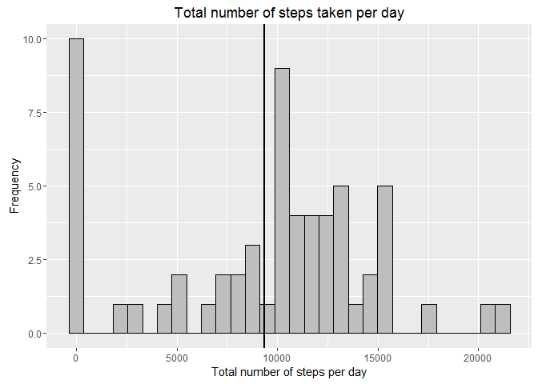
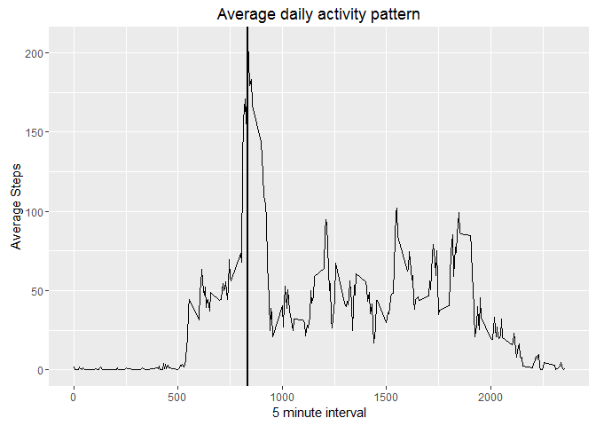
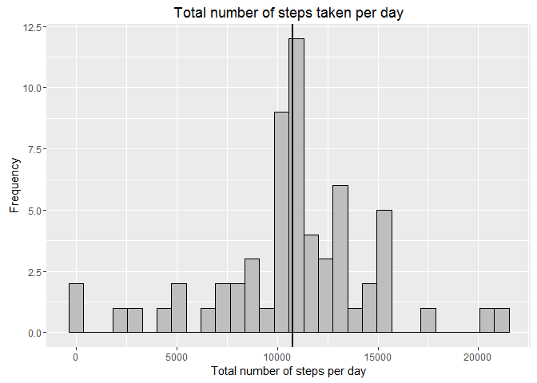
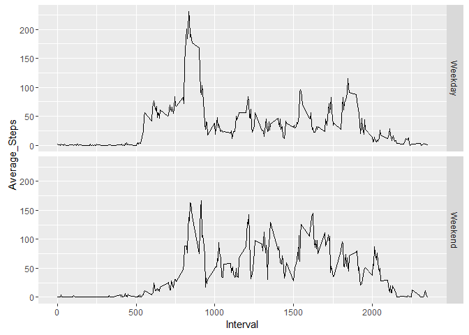

# Reproducible Research: Peer Assessment 1
Harish Kumar Rongala  

## Introduction

It is now possible to collect a large amount of data about personal movement using activity monitoring devices such as a Fitbit, Nike Fuelband, or Jawbone Up. These type of devices are part of the "quantified self" movement -- a group of enthusiasts who take measurements about themselves regularly to improve their health, to find patterns in their behavior, or because they are tech geeks. But these data remain under-utilized both because the raw data are hard to obtain and there is a lack of statistical methods and software for processing and interpreting the data.

This assignment makes use of data from a personal activity monitoring device. This device collects data at 5 minute intervals through out the day. The data consists of two months of data from an anonymous individual collected during the months of October and November, 2012 and include the number of steps taken in 5 minute intervals each day.

## 1. Loading and preprocessing the data

```r
# Link to download dataset
dataset_url<-"https://d396qusza40orc.cloudfront.net/repdata%2Fdata%2Factivity.zip";
if(!file.exists(paste(getwd(),"/activity.zip",sep="")))
        {
        if(!file.exists(paste(getwd(),"/activity.csv",sep="")))
                {
                download.file(dataset_url,paste(getwd(),"/activity.zip",sep=""));
                unzip("activity.zip");
                }
        }
# Read the dataset 
dataset<-read.csv("activity.csv",na.strings = "NA",header = TRUE);
# For ease of further processing, convert it to a data frame
dataset<-data.frame(dataset);
head(dataset);
```

```
##   steps       date interval
## 1    NA 2012-10-01        0
## 2    NA 2012-10-01        5
## 3    NA 2012-10-01       10
## 4    NA 2012-10-01       15
## 5    NA 2012-10-01       20
## 6    NA 2012-10-01       25
```

Let's find out if the "date" variable is in date class (posixct/posixlt). If not convert it to proper date class.

```r
print(class(dataset$date));
```

```
## [1] "factor"
```

```r
# convert it to date class
dataset$date<-as.POSIXct(dataset$date);
print(class(dataset$date));
```

```
## [1] "POSIXct" "POSIXt"
```

## 2. What is mean total number of steps taken per day?


```r
# Calculate sum of steps per day
steps_per_day<-aggregate(dataset$steps,by=list(dataset$date),FUN=sum,na.rm=TRUE);
# Label them appropriately
names(steps_per_day)<-c("Date","Steps");
head(steps_per_day);
```

```
##         Date Steps
## 1 2012-10-01     0
## 2 2012-10-02   126
## 3 2012-10-03 11352
## 4 2012-10-04 12116
## 5 2012-10-05 13294
## 6 2012-10-06 15420
```

```r
# Calculate mean
print(mean(steps_per_day$Steps));
```

```
## [1] 9354.23
```

```r
# Calculate median
print(median(steps_per_day$Steps));
```

```
## [1] 10395
```

```r
# Store these values for future reference
prev_mean<-mean(steps_per_day$Steps);
prev_median<-median(steps_per_day$Steps);

# Plot total number of steps taken per day
library(ggplot2);
g<-ggplot(steps_per_day,aes(steps_per_day$Steps));
g<-g+geom_histogram(color="black",fill="gray");
g<-g+labs(x="Total number of steps per day",y="Frequency",title="Total number of steps taken per day");
g<-g+geom_vline(xintercept = mean(steps_per_day$Steps),color="black",size=1);
print(g);
```

<!-- -->

In the above plot, black verticle line represents average total steps per day.

## 3. What is the average daily activity pattern?


```r
# Calculate average steps per interval
steps_per_interval<-aggregate(dataset$steps,by=list(dataset$interval),FUN=mean,na.rm=TRUE);
head(steps_per_interval);
```

```
##   Group.1         x
## 1       0 1.7169811
## 2       5 0.3396226
## 3      10 0.1320755
## 4      15 0.1509434
## 5      20 0.0754717
## 6      25 2.0943396
```

```r
# Label them appropriately
names(steps_per_interval)<-c("Interval","Average");

# Plot average daily activity
library(ggplot2);
g<-ggplot(steps_per_interval,aes(Interval,Average));
g<-g+geom_line();
g<-g+geom_vline(xintercept=steps_per_interval[steps_per_interval$Average==max(steps_per_interval$Average),]$Interval,color="black",size=1);
g<-g+labs(x="5 minute interval",y="Average Steps",title="Average daily activity pattern");
print(g);
```

<!-- -->

In the above plot, black verticle line represents maximum average steps at 5 minute interval.

## 4. Imputing missing values

```r
# Calculate total number of missing values
print(table(is.na(dataset)));
```

```
## 
## FALSE  TRUE 
## 50400  2304
```

```r
# Replace missing values with mean 5 minute interval
for(i in 1:nrow(dataset)){
        if(is.na(dataset[i,]$steps))
                {
                a<-dataset[i,]$interval;
                dataset[i,]$steps<-steps_per_interval[steps_per_interval$Interval==a,]$Average;
                }
        }
# Recalculate missing values
print(table(is.na(dataset)));
```

```
## 
## FALSE 
## 52704
```

```r
# Calculate total number of steps per day 
steps_per_day<-aggregate(dataset$steps,by=list(dataset$date),FUN=sum,na.rm=TRUE);
names(steps_per_day)<-c("Date","Steps");
# Calculate mean
print(mean(steps_per_day$Steps));
```

```
## [1] 10766.19
```

```r
# Calculate median
print(median(steps_per_day$Steps));
```

```
## [1] 10766.19
```

```r
# Save these values for comparision
cur_mean<-mean(steps_per_day$Steps);
cur_median<-median(steps_per_day$Steps);
# Plot new total number of steps taken per day
library(ggplot2);
g<-ggplot(steps_per_day,aes(steps_per_day$Steps));
g<-g+geom_histogram(color="black",fill="gray");
g<-g+labs(x="Total number of steps per day",y="Frequency",title="Total number of steps taken per day");
g<-g+geom_vline(xintercept = mean(steps_per_day$Steps),color="black",size=1);
print(g);
```

<!-- -->

In the above plot, black verticle line represents new average total steps per day. 


```r
res<-matrix(c(prev_mean,prev_median,cur_mean,cur_median),byrow=TRUE,ncol=2);
colnames(res)<-c("Mean","Median");
rownames(res)<-c("Ignoring NA's","Substituting NA's");
print(res);
```

```
##                       Mean   Median
## Ignoring NA's      9354.23 10395.00
## Substituting NA's 10766.19 10766.19
```

Observation: There is change in mean and median value after filling the NA's with mean value of 5 minute interval. There is increase in both mean and medians of total steps, by substituting NA's.

## 5. Are there differences in activity patterns between weekdays and weekends?

```r
for(i in 1:nrow(dataset)){
        if(weekdays(dataset[i,]$date)=="Saturday" | weekdays(dataset[i,]$date)=="Sunday")
        {
                dataset$week[i]<-"Weekend";
        }
        else
        {
                dataset$week[i]<-"Weekday";
        }
}
dataset$week<-as.factor(dataset$week);

# Average steps by weekday and weekend
avg_step_5min<-aggregate(dataset$steps,by=list(dataset$interval,dataset$week),FUN=mean);
head(avg_step_5min);
```

```
##   Group.1 Group.2          x
## 1       0 Weekday 2.25115304
## 2       5 Weekday 0.44528302
## 3      10 Weekday 0.17316562
## 4      15 Weekday 0.19790356
## 5      20 Weekday 0.09895178
## 6      25 Weekday 1.59035639
```

```r
names(avg_step_5min)<-c("Interval","Week","Average_Steps");
library(ggplot2);
g<-ggplot(avg_step_5min,aes(Interval,Average_Steps))+geom_line()+facet_grid(Week~.);
print(g);
```

<!-- -->

Observation: Clearly there is more activity during 10:00 to 20:00 on weekends rather than on weekdays. This could be obvious as weekdays involve work with lower physical activity.
